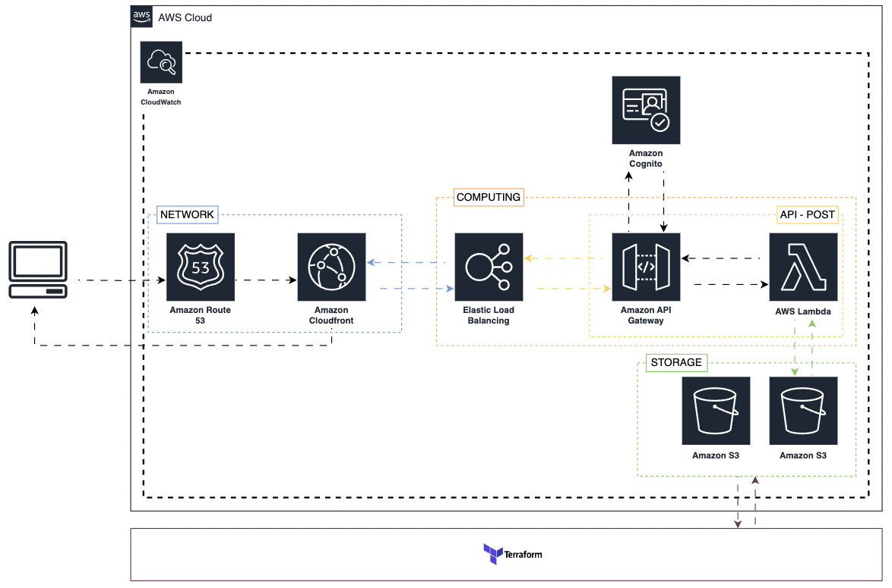

# ifood_MLEngineer_case

## Proposta de solução para os problemas abordados no case

1. Treinando um modelo: Criar um processo de fine-tuning para um modelo pré-treinado
2. API: Criar uma API que serve o modelo de IA generativa com documentação no Swagger
3. Arquitetura: Propor uma arquitetura para um dos pontos acima. (Escolhi a API)

### 1 - Model training

Para esta tarefa como não importava o modelo e o conjunto de dados, o escolhido foi o GPT2 e o News Article como conjunto de dados. No final ele deve te ajudar a criar títulos para artigos ou posts de determinado tema.

Para esse processo ser mais fácil foi criado um executável de uma aplicação CLI (Interface de linha de comando). Para rodar, basta digitar no terminal:

```
>> cd cli
>> cd command_line (Entre no diretorio cli e depois no diretorio command_line)
```

Para executar, digite o comando abaixo e pressione enter:

```
 ./cmd
```

Para o modelo foi criado um config.yml onde é possível passar as configurações para o treinamento, os famosos hiperparametros. O CLI serve para auxiliar com esses hiperparametros, e voce irá perceber que já há valores default, então caso não queira mudar nada, é só ir pressionando OK que será considerado o valor default daquele campo ja preenchido no config.yml.

### Próximos passos:

1. Refinamento de prompt usando engenharia de prompt para a etapa da construção do Datasetdict. O processo de PE (prompt engineer) consegue levar os modelos de GenAI a resultados comparáveis aos de fine-tuning, e combinar os processos pode trazer um melhor resultado na hora de treinar o modelo.
2. Dividir em mais bases de treinamento por temas, estilo de linguagem e etc.
3. Incluir mais hiperparametros no CLI sendo passados para o config.yml e sendo inseridos como parametros na hora de rodar a aplicação python que treina o modelo.
4. Utilizar o CLI para executar quando for preciso mudar algum hiperparamentro especifico, mas senão, usar uma estrutura baseada em eventos de novos dados nas bases de treinamento.

# 2 - Prompt API

A API processa prompts usando um script Python e o modelo que acabamos de realizar o fine-tuning. Ela inclui integração com Redis para cache, Nginx como loadbalancer, e está documentada usando o Swagger.

## Pré-requisitos

- Docker
- Docker Compose
- GoLang (para desenvolvimento local)
- Python (para desenvolvimento local)

## Instalação

1. **Clone o repositório:**

   ```sh
   git clone https://github.com/seu-usuario/ifood_case.git
   cd ifood_case
   ```

2. **Construa e inicie os contêineres Docker:**
   Na raiz do projeto onde contém o arquivo docker-compose.yml

   ```
   docker-compose build
   docker-compose up
   ```

## **Uso**

Após a execução a API estará disponivel em:

```
http://localhost:8080
```

E voce pode acessar a documentação acessando:

```
 http://localhost:8080/swagger/index.html.
```

## End-point

### `POST /prompt`

Processa um prompt usando script Python.

#### Parâmetros

- `prompt` (string): O prompt que será processado;
- `max_len` (int): O comprimento máximo do texto que será gerado.

**Exemplo da requisição:**

```
{
  "prompt": "oil price",
  "max_len": 50
}

```

**Exemplo da resposta:**

```
{
  "response": "Oil prices have been fluctuating recently..."
}

```

Você pode testar usando o curl ou uma ferramenta como o postman, por exemplo:

```
curl -X POST http://localhost:8080/prompt
    -H "Content-Type: application/json"
    -d '{"prompt": "oil price", "max_len": 50}'
```

### Próximos passos:

1. Integrar ferramentas de monitoramento e telemetria, como Prometheus e Grafana, para coletar métricas de desempenho e utilização da API.
2. Desenvolver testes automatizados com um pipeline CI/CD que execute a cada commit.
3. Incluir HTTPS para comunicação segura.
4. Incrementar middleware para autenticação e autorização.

# 3 - Arquitetura da API na AWS

## Diagrama da Arquitetura



## Componentes

### Route 53

- **Objetivo**: Serviço de resolução de DNS.
- **Função**: Altera o nome de domínio da API para o endereço do CloudFront.

### CloudFront

- **Objetivo**: Rede de Entrega de Conteúdo (CDN).
- **Função**: Verifica se a resposta está em cache. Se estiver, a resposta é retornada diretamente ao cliente. Caso contrário, o pedido é encaminhado para o ELB.

### Elastic Load Balancing (ELB)

- **Objetivo**: Distribui o tráfego de aplicação entre múltiplos alvos.
- **Função**: Distribui o pedido para uma das instâncias saudáveis do API Gateway.

### API Gateway

- **Objetivo**: Serviço totalmente gerenciado para criar, publicar, manter, monitorar e proteger APIs.
- **Função**: Processa o pedido, realiza autenticação, autorização e roteamento para a função Lambda correspondente.

### AWS Lambda

- **Objetivo**: Serviço de computação serverless.
- **Função**: Executa a lógica de negócios da API, acessa o DynamoDB para obter ou armazenar dados e retorna a resposta ao API Gateway.

### Cognito

- **Objetivo**: Serviço de gerenciamento de identidade e acesso.
- **Função**: Autenticação e autorização de usuários.

### S3

- **Objetivo**: Armazenamento de objetos escalável.
- **Função**: Armazena arquivos estáticos da API.

### CloudWatch

- **Objetivo**: Serviço de monitoramento e observabilidade.
- **Função**: Coleta logs, métricas e eventos da API.

## Etapas de Implantação

Para implementar a arquitetura da API na AWS, pode ser utilizado o Terraform. O Terraform possibilita definir e gerenciar a infraestrutura como código (IaC). É possível encontrar os código no diretório aws-api-infra, e seguir os passos:

**Inicialize o Terraform** :

```
terraform init
```

**Planeje a implantação** :

```
terraform plan -var="domain_name=example.com" -var="lambda_s3_bucket=my-lambda-bucket" -var="lambda_s3_key=my-lambda-code.zip"

```

**Aplique a implantação** :

```
terraform apply -var="domain_name=example.com" -var="lambda_s3_bucket=my-lambda-bucket" -var="lambda_s3_key=my-lambda-code.zip"
```

**Destruição** (quando necessário):

```sh
terraform destroy
```

## Monitoramento e Manutenção

- CloudWatch para monitorar o desempenho e a saúde da API.
- Configuração de alertas para métricas e erros críticos.

## Conclusão

A arquitetura apresentada utiliza serviços da AWS para criar uma API escalável, segura e altamente disponível. Ao usar serviços gerenciados como API Gateway, Lambda e Cognito, reduzimos a sobrecarga operacional e focamos em construir a funcionalidade principal da API. No diretório aws-api-infra é posível encontrar o Terraform para provisionar a arquitetura.
